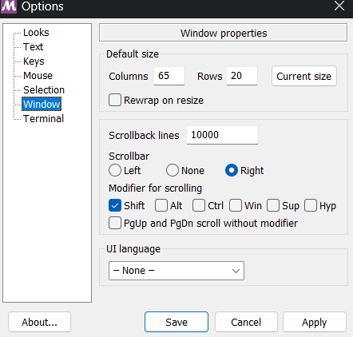
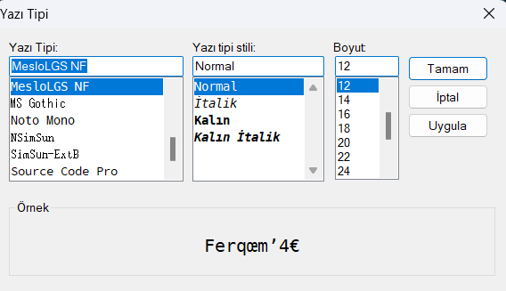

# My `ohmyzsh` Configuration


---

---

1. Visual Studio Code Download
   - [link](https://code.visualstudio.com/download)
2. Git Download
   - default editor --> vscode
   ```zsh
   git --version
   ```
3. solarized theme download
   - [link](https://github.com/speedpacer/gitbash_solarized)
4. 
5. Install ZSH Windows Git Bash
   - [link](https://gist.github.com/fworks/af4c896c9de47d827d4caa6fd7154b6b)
6. oh my zsh git bash download
   - [link](https://gist.github.com/fworks/af4c896c9de47d827d4caa6fd7154b6b)
7. oh my zsh powerlevel10k
   - [link](https://github.com/romkatv/powerlevel10k)
8. oh my zsh highlighter
   - [link](https://github.com/zsh-users/zsh-syntax-highlighting/blob/master/INSTALL.md)
9. Optional

   - oh my zsh autocomplate
   - [link](https://gist.github.com/n1snt/454b879b8f0b7995740ae04c5fb5b7df)

10. 
11. `~/.zshrc`

```sh
# git aliases
alias g='git'
alias ga='git add'
alias gaa='git add .'
alias gst='git status'
alias gsts='git status --short'
alias gi='git init' # .git --> Local Repo , git istenilen dosyalari takip etsin
alias gcm="git commit -m"
alias gac='git add . && git commit -m' # git commit -am "initial commit"
alias gr='git remote'
alias gb='git branch --list'
alias gbr='git branch --remote'
alias gbdelete='git branch -d'
alias gshw='git show' # son yapilan commit
alias gl='git log'
alias glo='git log --online'
alias glga='git log --graph --online --decorate --all'
alias gls='git log --since='
alias glp='git log -p -'
alias gsth='git stash'
alias gsthc='git stash clear'
alias gsthl='git stash --list'
alias gstha='git stash apply'
alias gsthp='git stash pop'
alias gs='git switch'
alias gc='git checkout'
alias gcb='git checkout -b'
alias gcm='git checkout master'
alias gm='git merge'
alias gd='git diff'
alias gdh='git diff head'
alias gcl='git clone'
alias grao='git remote add origin'
alias gpuom='git push -u origin master'
alias gf='git fetch'
alias gpl='git pull'
alias gp='git push'
alias gpo='git push origin'
alias grt='git revert'
alias grs='git restore --staged' # SA --> WD
alias grestore='git restore' # Degisiklikleri iptal etme
alias gresets='git reset --soft' # LR --> SA
alias gresetm='git reset --mixed' # SA --> WD
alias greseth='git reset --hard' # WD --> CLEAR

alias grm='git rm --cached' #Staging Area --> Working Directory
alias gcf='git config --list'
alias grmrc='git rm -r --cached' # Takipteki dosyalari izlemeden kaldir
alias grro='git remote remove origin' # kayıtlı origin'i silmek için kullanılır
alias tree='cmd //c tree //a'

# other aliases
alias c="../../.."
alias desktop="**/**/Desktop"
alias zshrc="code ~/.zshrc"

#
alias a='ls -a'
alias cls="clear"
alias rm="=rm -rf"
alias ip='ipconfig'

# program aliases
alias mysql='winpty mysql -u root -p'
alias obsidian="C:/**/**/AppData/Local/Obsidian/Obsidian.exe"
alias insomnia="C:/**/**/AppData/Local/insomnia/Insomnia.exe"
alias idea="C:/**/**/AppData/Local/JetBrains/Toolbox/apps/IDEA-U/ch-0/223.8617.56/bin/idea64.exe"
alias st="C:/Program\ Files/Sublime\ Text\ 3/sublime_text.exe"


ZSH_THEME="norm"

HYPHEN_INSENSITIVE="true"

ENABLE_CORRECTION="true"

plugins=(git
        zsh-syntax-highlighting)

cd /c/**/**/Desktop
```
